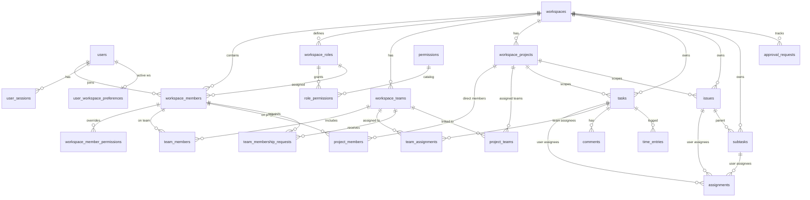

# Entities & Project Structure

**Jellyfish Workspace (TMS) · v2.1.0**

This document maps the application's **entities**, **database tables**, **relationships**, and **code layout** so you can understand the project quickly.

Related docs: [README.md](README.md) · [CHANGELOG.md](CHANGELOG.md)

---

## How the app is organized

```
┌─────────────────────────────────────────────────────────────────┐
│                         React Frontend (Vite)                    │
│  pages/ · context/ · shared/ · services/api.ts                  │
└────────────────────────────┬────────────────────────────────────┘
                             │ REST + Socket.IO
┌────────────────────────────▼────────────────────────────────────┐
│                      Express Backend (TypeScript)                  │
│  routes/ · middleware/ · services/ · permissions/               │
│  AuthorizationService · permissionResolver · approvalFlows      │
└────────────────────────────┬────────────────────────────────────┘
                             │ better-sqlite3
┌────────────────────────────▼────────────────────────────────────┐
│                    SQLite (backend/data/app.db)                  │
└─────────────────────────────────────────────────────────────────┘
```

### Request flow (simplified)

```
User action (UI)
  → API request (Bearer JWT, optional X-Workspace-Security-Version)
  → authMiddleware (validate token + session)
  → workspaceAuth / requireEntityPerm (AuthorizationService.authorize)
  → service layer (business logic)
  → SQLite
  → response (+ X-Request-Id)
```

### Workspace scope

Almost everything belongs to a **workspace**. The user picks an **active workspace** after login. Permissions, teams, tasks, and files are evaluated inside that workspace context.

---

## Entity groups

| Group | Purpose |
|-------|---------|
| **Identity** | Users, sessions, preferences |
| **Workspace** | Multi-tenant container for all work |
| **RBAC** | Roles, permissions, membership, overrides |
| **Approvals** | Permission requests and decisions |
| **Teams** | Groups within a workspace; multi-team membership via `team_members` |
| **Projects** *(2.1)* | Workspace projects, direct members, team links, access resolver |
| **Work items** | Tasks, issues, subtasks |
| **Collaboration** | Comments, assignments, notifications, activity |
| **Files & time** | Attachments and timesheets |
| **Security** | Audit events and monitoring |
| **Configuration** | Custom statuses per entity type |

---

## Identity

### User

| | |
|---|---|
| **Table** | `users` |
| **Purpose** | Global account (can belong to many workspaces) |
| **Key fields** | `id`, `username`, `email`, `password_hash`, `avatar_path`, `created_at` |
| **Backend** | `services/auth.ts` |
| **Frontend** | `AuthContext`, `LoginPage`, `SettingsPage` |

### User session

| | |
|---|---|
| **Table** | `user_sessions` *(new in 2.0)* |
| **Purpose** | Server-side session tracking and revocation |
| **Key fields** | `id`, `user_id`, `refresh_token_hash`, `user_agent`, `status`, `expires_at`, `revoked_at` |
| **Backend** | `services/sessions.ts`, `middleware/auth.ts` |
| **API** | `POST /api/auth/logout`, `GET /api/auth/sessions` |

JWT may include `sid` (session id). Revoked sessions are rejected with 401.

### User workspace preference

| | |
|---|---|
| **Table** | `user_workspace_preferences` |
| **Purpose** | Stores each user's **active workspace** |
| **Key fields** | `user_id`, `active_workspace_id` |
| **Backend** | `services/authorization.ts`, `services/workspaces.ts` |
| **Frontend** | `WorkspaceContext`, `WorkspaceSwitcher` |

---

## Workspace

### Workspace

| | |
|---|---|
| **Table** | `workspaces` |
| **Purpose** | Top-level tenant; isolates data and permissions |
| **Key fields** | `id`, `user_id` (creator), `name`, `description`, `approval_flows_enabled`, `is_active` |
| **Backend** | `services/workspaces.ts` |
| **Frontend** | `WorkspacesPage`, `WorkspaceDetailPage`, `WorkspaceOnboardingPage` |
| **API** | `/api/workspaces` |

### Workspace invitation

| | |
|---|---|
| **Table** | `workspace_invitations` |
| **Purpose** | Email/code invites to join a workspace with a role |
| **Key fields** | `email`, `role_id`, `token`, `invite_code`, `status`, `expires_at` |
| **Backend** | `services/workspaceMembers.ts` |
| **Frontend** | `InviteLandingPage` |

---

## RBAC (roles & permissions)

### Permission (catalog)

| | |
|---|---|
| **Table** | `permissions` |
| **Purpose** | Global catalog of permission codes (shared across workspaces) |
| **Examples** | `task.view`, `task.delete`, `approval.decide.tasks`, `team.review_join_request` |
| **Source** | `backend/src/permissions/catalog.ts` |

### Workspace role

| | |
|---|---|
| **Table** | `workspace_roles` |
| **Purpose** | Named role within a workspace (Owner, Admin, Developer, …) |
| **Key fields** | `workspace_id`, `name`, `slug`, `is_system` |
| **Backend** | `services/workspaceRoles.ts` |

System role **`owner`** has all permissions and cannot be customized.

### Role permission

| | |
|---|---|
| **Table** | `role_permissions` |
| **Purpose** | Maps a role to a permission with a **tri-state effect** |
| **Key fields** | `role_id`, `permission_code`, **`effect`** *(2.0)* |
| **Effect values** | `allow` · `approval_required` · `deny` |
| **Backend** | `services/permissions.ts`, `permissionResolver.ts` |

**Effective permission resolution order:**
1. Owner → all permissions
2. Role effect from matrix
3. Member overrides (grants add, denies remove)

### Workspace member

| | |
|---|---|
| **Table** | `workspace_members` |
| **Purpose** | Links a user to a workspace with a role |
| **Key fields** | `workspace_id`, `user_id`, `role_id`, **`security_version`** *(2.0)* |
| **Backend** | `services/workspaceMembers.ts`, `services/authorization.ts` |

`security_version` increments when anything affecting this member's authorization changes.

### Member permission override

| | |
|---|---|
| **Table** | `workspace_member_permissions` |
| **Purpose** | Owner-granted per-user grants or denies (typically for admins) |
| **Key fields** | `member_id`, `permission_code`, `effect` (`grant` \| `deny`) |
| **Backend** | `services/memberPermissions.ts` |
| **Frontend** | `WorkspacePermissionsPage`, `UserAccessPanel` |

---

## Approvals

### Approval request

| | |
|---|---|
| **Table** | `approval_requests` |
| **Purpose** | Request to perform an action that requires approval |
| **Key fields** | `workspace_id`, `requester_id`, `permission_code`, `status`, `attempt_number`, `request_type`, `payload_json`, `decided_by` |
| **Statuses** | `pending`, `approved`, `rejected`, `cancelled`, `expired`, `executed`, `failed` |
| **Backend** | `services/approvalFlows.ts`, `approvalEvents.ts` |
| **Frontend** | `ApprovalsContext`, `WorkspacePermissionsPage` |

**Flow:**

```
Member attempts action → 403 APPROVAL_REQUIRED
  → submits approval request
  → authorized decider approves/rejects (authority re-checked at decision time)
  → on approve: permission override granted or action executed
```

Deciders need `approval.decide.*` permissions (or owner).

---

## Teams

### Workspace team

| | |
|---|---|
| **Table** | `workspace_teams` |
| **Purpose** | Named group inside a workspace |
| **Key fields** | `workspace_id`, `name`, `description`, `lead_member_id` |
| **Backend** | `services/teams.ts` |
| **Frontend** | `TeamsPage` |

### Team member

| | |
|---|---|
| **Table** | `team_members` |
| **Purpose** | Links a workspace member to a team |
| **Key fields** | `team_id`, `member_id`, `joined_at`, **`role_in_team`** *(2.1, optional)* |

### Team join request

| | |
|---|---|
| **Table** | `team_membership_requests` *(new in 2.0)* |
| **Purpose** | Member requests to join a team; team lead approves/rejects |
| **Key fields** | `team_id`, `requester_member_id`, `status`, `attempt_number`, `decided_by` |
| **Backend** | `services/teamMembershipRequests.ts` |

### Team assignment

| | |
|---|---|
| **Table** | `team_assignments` *(new in 2.0)* |
| **Purpose** | Assign a team to a work item |
| **Key fields** | `team_id`, `entity_type` (`task` \| `issue` \| `subtask`), `entity_id` |
| **Backend** | `services/teamAssignments.ts` |

---

## Projects *(new in 2.1)*

### Workspace project

| | |
|---|---|
| **Table** | `workspace_projects` |
| **Purpose** | Named project inside a workspace (e.g. product line, client engagement) |
| **Key fields** | `workspace_id`, `name`, `description`, `status` (`active` \| `archived`), `lead_member_id` |
| **Backend** | `services/projects.ts`, `services/projectAccess.ts` |
| **Frontend** | `ProjectsPage` |

### Project member

| | |
|---|---|
| **Table** | `project_members` |
| **Purpose** | Direct membership on a project (independent of team membership) |
| **Key fields** | `project_id`, `member_id`, `role_in_project` (`lead` \| `member` \| `reviewer`) |
| **Backend** | `services/projects.ts` |

A user may belong to **many projects** in the same workspace. There is no `user.projectId`.

### Project team

| | |
|---|---|
| **Table** | `project_teams` |
| **Purpose** | Links a team to a project — all team members gain project access |
| **Key fields** | `project_id`, `team_id` |
| **Backend** | `services/projects.ts` |

### Project access model

Effective access for a workspace member:

```
direct project_members row
  OR
member of a team linked via project_teams
  OR
workspace owner (full oversight)
```

Resolved by `resolveProjectAccess()` in `services/projectAccess.ts`. Used by project list/detail APIs and member summary endpoints.

### Work item project scope *(schema 2.1)*

| Table | Column | Purpose |
|-------|--------|---------|
| `tasks` | `project_id` | Optional link to a workspace project |
| `issues` | `project_id` | Optional link to a workspace project |
| `time_entries` | `project_id` | Optional link for timesheet attribution |

UI wiring for create/edit flows is planned; columns are migrated and ready.

---

## Work items

### Task

| | |
|---|---|
| **Table** | `tasks` |
| **Scope** | `workspace_id` |
| **Key fields** | `title`, `description`, `status`, `priority`, `severity`, `due_date` |
| **Backend** | `services/tasks.ts` |
| **Frontend** | `TasksPage`, `TaskDetailPage`, `TaskCreatePage`, `TaskEditPage` |
| **API** | `/api/tasks` |

### Issue

| | |
|---|---|
| **Table** | `issues` |
| **Scope** | `workspace_id` |
| **Similar to** | Tasks (severity, status, assignees) |
| **Backend** | `services/issues.ts` |
| **Frontend** | `IssuesPage`, `IssueDetailPage`, `IssueCreatePage` |

### Subtask

| | |
|---|---|
| **Table** | `subtasks` |
| **Scope** | `workspace_id` |
| **Parent** | Linked to a task or issue |
| **Backend** | `services/subtasks.ts` |
| **Frontend** | `SubtasksPage` |

### Assignment (user ↔ entity)

| | |
|---|---|
| **Table** | `assignments` |
| **Purpose** | Assign workspace members to tasks, issues, or subtasks |
| **Backend** | `services/entityAssignments.ts` |
| **Frontend** | `AssignmentsPage`, `AssigneePicker` |

### Workspace status

| | |
|---|---|
| **Table** | `workspace_statuses` |
| **Purpose** | Custom status labels/colors per entity type |
| **Key fields** | `workspace_id`, `entity_type`, `slug`, `label`, `is_closed` |
| **Backend** | `services/workspaceStatuses.ts` |
| **Frontend** | `StatusContext` |

---

## Collaboration

### Comment

| | |
|---|---|
| **Table** | `comments` |
| **Attached to** | task, issue, or subtask |
| **Backend** | `services/comments.ts` |

### Notification

| | |
|---|---|
| **Table** | `notifications` |
| **Scope** | Per user; may include `workspace_id` |
| **Backend** | `services/notifications.ts` |
| **Frontend** | `NotificationContext`, `NotificationsPage` |
| **Realtime** | `notification:new`, `notification:sync` |

### Activity log

| | |
|---|---|
| **Table** | `activity_logs` |
| **Purpose** | Workspace/entity change history (user-facing audit) |
| **Backend** | `services/activityLogger.ts` |
| **Frontend** | `ActivityPage` |

---

## Files & time

### Workspace file

| | |
|---|---|
| **Table** | `workspace_files` |
| **Storage** | `backend/data/uploads/{workspaceId}/` |
| **Key fields** | `workspace_id`, `entity_id`, `category`, `mime_type`, safe filename |
| **Backend** | `services/files.ts` |
| **Frontend** | `FilesPage` |

### Time entry

| | |
|---|---|
| **Table** | `time_entries` |
| **Purpose** | Log hours against task, issue, or subtask |
| **Key fields** | `user_id`, `workspace_id`, `entity_type`, `entity_id`, `work_date`, `hours`, **`project_id`** *(2.1, optional)* |
| **Backend** | `services/timeEntries.ts` |
| **Frontend** | `TimesheetsPage` |

---

## Security

### Security event

| | |
|---|---|
| **Table** | `security_events` *(new in 2.0)* |
| **Purpose** | Append-only security/audit log (SOC-style monitoring) |
| **Key fields** | `action`, `result`, `risk_level`, `actor_user_id`, `workspace_id`, `request_id`, `event_hash`, `previous_hash` |
| **Backend** | `services/securityEvents.ts` |
| **Frontend** | `SecurityCenterPage` (owner only) |
| **API** | `GET /api/security/workspaces/:id/events` |

Immutable hash chain — records are not updated or deleted via API.

---

## Entity relationship diagram



---

## Frontend structure

| Path | Purpose |
|------|---------|
| `context/AuthContext.tsx` | Login, logout, session token |
| `context/WorkspaceContext.tsx` | Active workspace, switcher data |
| `context/PermissionsContext.tsx` | Effective permissions, security version, realtime refresh |
| `context/ApprovalsContext.tsx` | Pending approvals, realtime updates |
| `context/MembersContext.tsx` | Workspace members list |
| `context/NotificationContext.tsx` | Notifications + Socket.IO |
| `context/SocketProvider.tsx` | Shared Socket.IO connection *(2.1)* |
| `shared/PermissionGate.tsx` | Route/UI permission checks (UX only) |
| `shared/WorkspaceSwitcher.tsx` | Switch active workspace |
| `shared/ResourceLayout.tsx` | Master-detail layout for Teams/Projects *(2.1)* |
| `shared/MemberMembershipPanel.tsx` | Member teams/projects summary *(2.1)* |
| `shared/entityType/EntityTypeBadge.tsx` | Task/Issue/Subtask color badges *(2.1)* |
| `hooks/useAsyncSession.ts` | Stale async cancellation *(2.1)* |
| `App.tsx` | Root providers (Auth, Workspace, Socket, …) *(2.1)* |
| `routes/AppRoutes.tsx` | Route tree only *(2.1)* |
| `services/api.ts` | REST client, security version header |

### Main routes

| Route | Page | Permission (typical) |
|-------|------|----------------------|
| `/login` | Login | — |
| `/onboarding` | Create first workspace | — |
| `/workspaces` | Workspace list | — |
| `/dashboard` | Dashboard | `workspace.view` |
| `/tasks`, `/issues`, `/subtasks` | Work lists | `task.view`, etc. |
| `/teams` | Teams & join requests | `team.view` |
| `/projects` | Projects, members & teams *(2.1)* | `project.view` |
| `/workspaces/:id/permissions` | Roles, approvals & member summary | `member.view` |
| `/security` | Security Center | Owner only |
| `/settings` | Profile & version | — |

---

## Backend structure

| Path | Purpose |
|------|---------|
| `services/authorizationService.ts` | **Central** `authorize()` — always fresh from DB |
| `services/permissionResolver.ts` | Tri-state resolution, approval-decide checks |
| `services/authorization.ts` | Membership, effective permissions, member context |
| `services/approvalFlows.ts` | Submit, approve, reject approvals |
| `services/securityVersion.ts` | Bump `security_version`, emit realtime |
| `services/securityEvents.ts` | Append-only audit log |
| `services/sessions.ts` | Create, validate, revoke sessions |
| `services/projects.ts` | Project CRUD, members, team links *(2.1)* |
| `services/projectAccess.ts` | Effective project access resolver *(2.1)* |
| `middleware/auth.ts` | JWT + session validation |
| `middleware/workspaceAuth.ts` | Permission middleware for routes |
| `middleware/requestContext.ts` | `X-Request-Id`, security headers |
| `middleware/rateLimit.ts` | Auth & approval throttling |
| `migrate.ts` | All schema migrations (run on startup) |

---

## What changed in 2.1

Structural additions compared to **2.0.0**:

| Item | 2.0 | 2.1 |
|------|-----|-----|
| **`workspace_projects`** | — | New table |
| **`project_members`** | — | New table (multi-project membership) |
| **`project_teams`** | — | New table (project ↔ team many-to-many) |
| **`tasks.project_id`** | — | Optional FK to project |
| **`issues.project_id`** | — | Optional FK to project |
| **`time_entries.project_id`** | — | Optional FK to project |
| **`team_members.role_in_team`** | — | Optional per-team role |
| **Project permissions** | — | `project.view`, `project.create`, … in catalog |
| **Frontend routes** | Teams only | + `/projects`, member summary on permissions |
| **Socket architecture** | Per-context connections | Shared `SocketProvider` + `requestCache` |
| **App bootstrap** | Routes in single module | Providers in `App.tsx`, routes in `AppRoutes.tsx` |

### Membership model (2.1)

| Concept | Correct model | **Not** used |
|---------|---------------|--------------|
| Team membership | `team_members` (many teams per user) | `user.teamId` |
| Project membership | `project_members` + `project_teams` | `user.projectId` |
| Effective project access | Direct ∪ team-derived (`projectAccess.ts`) | Single global project |

---

## What changed in 2.0

Structural additions and changes compared to **1.0.0**:

| Item | 1.0 | 2.0 |
|------|-----|-----|
| **Navigation model** | Single workspace implied | Explicit workspace selection + active context |
| **`role_permissions.effect`** | Not present (implicit allow) | `allow` / `approval_required` / `deny` |
| **`workspace_members.security_version`** | — | Added |
| **`user_sessions`** | — | New table |
| **`security_events`** | — | New table |
| **`team_membership_requests`** | — | New table |
| **`team_assignments`** | — | New table |
| **`approval_requests` extensions** | Basic pending/approved/rejected | + `request_type`, `payload_json`, `attempt_number`, `decided_by`, … |
| **`user_workspace_preferences`** | — | Active workspace per user |
| **Authorization** | Scattered checks | `AuthorizationService` + route middleware |
| **Realtime events** | Notifications | + `permissions:updated`, `security.changed`, `approvals:changed` |
| **Session model** | JWT only | JWT + server session registry |
| **Frontend contexts** | Auth, workspace | + Permissions, Approvals, security handlers |

### Safe permission migration (1.x → 2.0)

| Old state | New state |
|-----------|-----------|
| Permission granted on role | `role_permissions.effect = 'allow'` |
| Permission not on role | Resolves to **DENY** (not auto-mapped to approval) |
| Owner role | Unchanged — all permissions |

---

## Permission groups (catalog summary)

| Group | Example codes |
|-------|----------------|
| Workspace | `workspace.view`, `workspace.edit`, `workspace.delete` |
| Teams | `team.view`, `team.create`, `team.review_join_request` |
| Projects *(2.1)* | `project.view`, `project.create`, `project.manage_members`, `project.assign_teams`, … |
| Approvals | `approval.decide`, `approval.decide.tasks`, … |
| Tasks | `task.view`, `task.create`, `task.delete`, … |
| Issues | `issue.view`, `issue.create`, … |
| Subtasks | `subtask.view`, `subtask.create`, … |
| Files | `file.view`, `file.upload`, … |
| Collaboration | `comment.create`, `activity.view`, `notification.view` |
| Timesheets | `timesheet.view`, `timesheet.create`, … |
| Members | `member.view`, `member.invite`, `member.change_role` |

Full list: `backend/src/permissions/catalog.ts`

---

## Quick reference — all database tables

| Table | Group |
|-------|-------|
| `users` | Identity |
| `user_sessions` | Identity / Security |
| `user_workspace_preferences` | Identity |
| `workspaces` | Workspace |
| `workspace_invitations` | Workspace |
| `permissions` | RBAC |
| `workspace_roles` | RBAC |
| `role_permissions` | RBAC |
| `workspace_members` | RBAC |
| `workspace_member_permissions` | RBAC |
| `approval_requests` | Approvals |
| `workspace_teams` | Teams |
| `team_members` | Teams |
| `team_membership_requests` | Teams |
| `team_assignments` | Teams |
| `workspace_projects` | Projects *(2.1)* |
| `project_members` | Projects *(2.1)* |
| `project_teams` | Projects *(2.1)* |
| `tasks` | Work items |
| `issues` | Work items |
| `subtasks` | Work items |
| `assignments` | Work items |
| `workspace_statuses` | Configuration |
| `comments` | Collaboration |
| `notifications` | Collaboration |
| `activity_logs` | Collaboration |
| `workspace_files` | Files |
| `time_entries` | Time |
| `security_events` | Security |

**Total: 30 tables**

---

## Scripts & verification

```powershell
npm run dev              # Start frontend + backend
npm run build            # Production build
npm run reset-db         # Reset DB + demo seed (stop backend first)
npm run security-test --prefix backend   # Authorization tests
```

Demo password for all seeded users: **`demo1234`**
